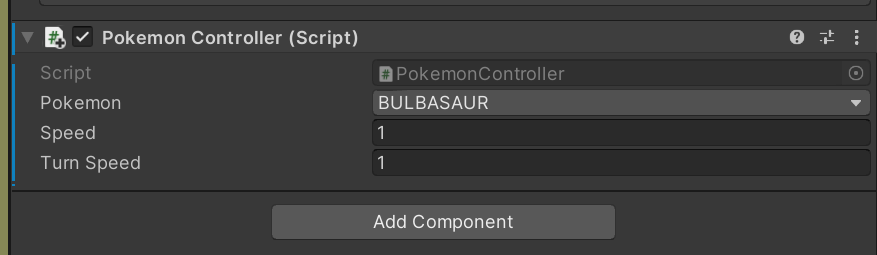

# 游戏全局变量
## 简介
由于本游戏包含动画、UI等不同部分，各个部分之间需要同步游戏状态，故设置全局变量。

比如说一只宝可梦由于检测到和水果（武器）发生碰撞而触发了战斗，那么他就可以通过修改名为`status`的变量，使得游戏UI等其他部分通过读取变量得知目前进入了新的状态，从而做自己该做的事（比如UI从巡游状态切换至战斗状态）。

全局变量名称为`Global`，脚本为`Global.cs`，继承了`MonoBehavior`类并绑定在FPC上。由于FPC在游戏中不会被销毁，所以这样做应该是安全的。
## 全局变量介绍
### 游戏状态
游戏状态采用了枚举类型，游戏目前分为玩家巡游状态和战斗状态，之后若需要添加新的类型则继续添加。
```
public GameStat status;
```
```
public enum GameStat
    {
        WALK,
        BATTLE
    }
```

#### 用例
在控制宝可梦的脚本中，需要根据当前游戏状态，使宝可梦播放不同的动画。可以通过读取`global.status`实现。
```
void Update()
    {
        switch(global.status)
        {
            case Global.GameStat.WALK:
                // Some code...
                break;
            case Global.GameStat.BATTLE:
                // Some code...
                break;
        }        
    }
```

### 宝可梦类型
宝可梦类型是一个枚举类型，需要在宝可梦中添加。
```
public enum Pokemon
    {
        BULBASAUR,
        SQUIRTLE,
        CHARMANDER
    }
```

#### 用例
目前在`PokemonController`中嵌入了
```
 public Global.Pokemon pokemon;
```
并由开发者在Unity Editor中赋值，以进行初始化。


### 水果类型
水果采用枚举类型，需要在能采摘和能发射的水果中添加，主要用于战斗过程中各种伤害逻辑的判定。
```
public enum Berry
    {
        BLUE,
        GREEN,
        ORANGE,
        PINK,
        YELLOW,
        NULL
    }
```

### 水果数量
目前有5种水果，采用Dicionary（Key-Value pair）的方式进行存储。各业务可以读写。
```
public Dictionary<Berry, int> berryCount = new Dictionary<Berry, int>();
```

#### 用例
获取蓝色水果的数量，可以获得一个`int`变量。
```
global.berryCount[Global.Berry.BLUE]
```
### Pokemon Ball 数量
由`Global`自行初始化，其他业务可以直接读写。
```
public int pokemonBallCount;
```

### 血槽
由`Global`负责初始化和战斗之间的恢复逻辑，其他业务可以读写。
```
public int hp;
```

### 已获得的宝可梦数量
由`Global`负责初始化，`Battle`负责修改，其他业务可以读写。
```
public int pokemonCount;
```

### 已获得的宝可梦的列表
是一个数组，由`Battle`负责添加，其他业务可以读写。
初始化容量为10。
```
public Pokemon[] pokemons;
```
通过下标可以访问，返回一个`Pokemon`枚举变量。

### 当前进行的战斗
`Global`中有一个`Battle`对象，初始化为`null`，仅当战斗开始时创建新对象，战斗结束后销毁。
```
public Battle battle;
```
其他业务可以在战斗中通过`global.battle.xxx`访问`Battle`中的变量和方法。
具体介绍请往下翻。

## 如何初始化以使用全局变量和方法
首先在自己的脚本中声明两个变量，一个是`player`，一个是`global`。
```
private GameObject player;
private Global global;
```
然后在`Awake()`或`Start()`中通过查找进行初始化。
```
player = GameObject.Find("Player");
global = player.GetComponent<Global>();
```
然后就可以通过`global.xxx`访问和修改任何一个全局变量，也可以使用上面的方法了。


# 战斗相关
## 方法介绍
### 构造函数
创建一场新的战斗。
目前的想法是在Pokemon的OnCollide中实现战斗的创建，不要在其他地方随意创建战斗。
```
public Battle(Global.Pokemon mPokemon)
```

### 扔水果
玩家在发出扔水果指令之后调用，参数为水果类型。
如果返回`true`，代表可以扔。
如果返回`false`，代表因为库存不足或者其他原因，不可以扔。
```
public bool ThrowBerry(Global.Berry berry)
```

### 扔完水果了
在水果砸到宝可梦或者砸到地上时调用，参数为`bool`。
如果水果砸到宝可梦，调用时请传`true`。
如果没砸到，请传`false`。
```
public void BerryHit(bool success)
```
### 扔宝可梦球
玩家在发出扔球指令之后调用。
如果返回`true`，代表可以扔。
如果返回`false`，代表因为库存不足或者其他原因，不可以扔。
```
public bool ThrowBall()
```

### 扔完宝可梦球了
在宝可梦球的OnCollide中调用，返回一个`bool`。函数会自行根据战斗结果计算是否成功。
如果成功返回`true`，失败返回`false`。
```
public bool BallHit()
```

## 变量介绍
提示：一般情况下业务不需要访问或者修改`Battle`中的变量，如果你需要进行战斗相关的操作，请先查阅`Battle`中有没有事先写好的方法可以用。但为了拥有更好的扩展性，以下变量被设置为`public`。
### 发生什么事了
一个`bool`变量，用来判断当前是谁的回合，如果轮到玩家出招则是`true`，如果轮到宝可梦出招则是`false`。
```
public bool isPlayerTurn;
```

### 你在和谁战斗
```
public Global.Pokemon pokemon;
```

### 宝可梦快乐吗
战斗开始时初始化。
```
public int pokemonHappiness;
```

### 成功率
`Battle`会自行计算成功率。
```
public int successRate;
```

### 扔了几个宝可梦球
```
public int throwCount;
```

### 上一次砸中宝可梦的水果是什么
如果上一次扔的水果没有砸中宝可梦，则是`Berry.NULL`
```
public Global.Berry lastBerry;
```